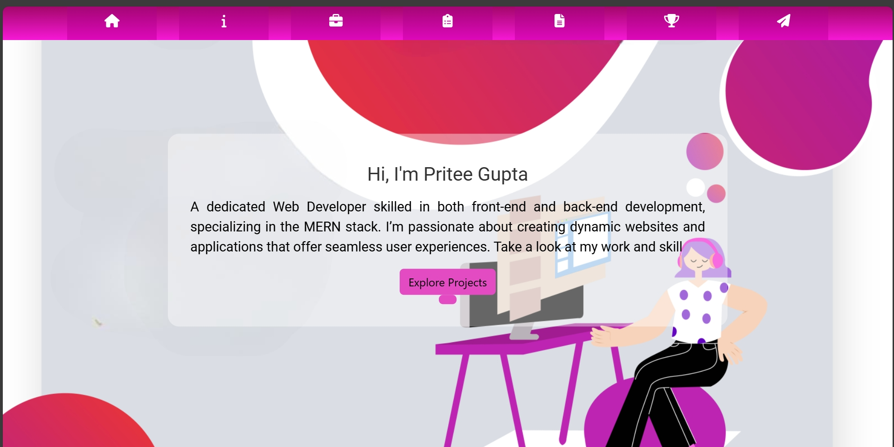
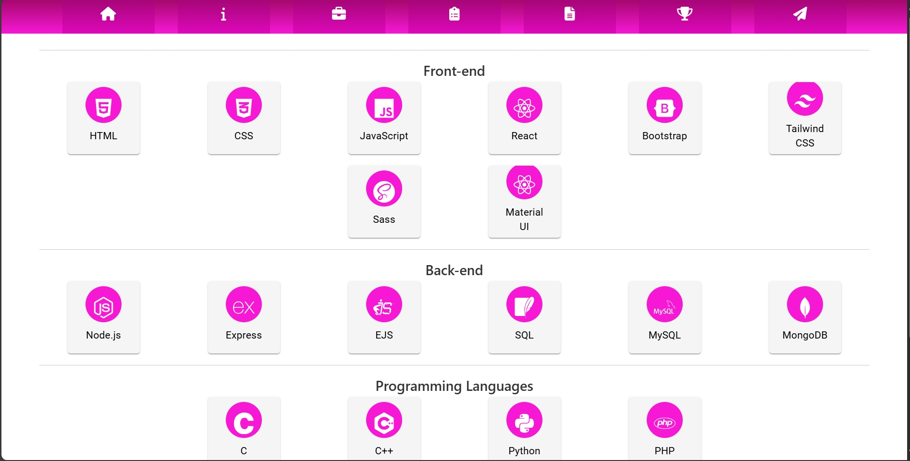

# My Portfolio

Welcome to my personal portfolio! This is a React-based application that highlights my skills, experience, and projects. It features a modern design with interactive elements to showcase various technologies and tools I have worked with.

## Features

- **Skills Section**: Showcases my expertise in Front-end, Back-end, Programming Languages, and Tools.
- **Resume Display**: An option to view and download my resume in a user-friendly format.
- **Responsive Layout**: Optimized for various screen sizes, ensuring a seamless experience across mobile, tablet, and desktop devices.
- **Technologies Showcased**: Demonstrates my skills with visual representations and icons of various technologies.

## Technologies Used

- **React**: A JavaScript library for building dynamic user interfaces.
- **Material UI**: A popular React UI framework for creating stylish components.
- **React Icons**: A library of icons for enhancing the UI.
- **CSS**: Custom styling for creating a sleek and modern look.
- **Flexbox**: A layout tool used to create a responsive design.


## Setup Instructions

To run the portfolio locally, follow these steps:

### Prerequisites

- **Node.js** (v14 or higher)
- **npm** (Node Package Manager)

### Steps to Run

1. Clone the repository:

    ```bash
    git clone https://github.com/Pritee668/Portfolio.git
    ```

2. Navigate into the project folder:

    ```bash
    cd portfolio
    ```

3. Install the dependencies:

    ```bash
    npm install
    ```

4. Run the development server:

    ```bash
    npm start
    ```

5. Open the app in your browser:

    Go to `http://localhost:3000` to see the portfolio in action.

## Deployment

This portfolio can be easily deployed on platforms like [Vercel](https://vercel.com/) or [Netlify](https://www.netlify.com/). You can follow the instructions on these platforms to deploy directly from this GitHub repository.

## Screenshots

Here are some preview images of the portfolio:





## License

This project is licensed under the MIT License - see the [LICENSE](LICENSE) file for details.

## Acknowledgements

- **Material UI** for the UI components.
- **React Icons** for providing the icon library.
- **React** for the web framework.

## Contact

Feel free to reach out to me at [your-email@example.com](mailto:your-email@example.com) for any inquiries or collaboration opportunities.

---
**Thank you for visiting my portfolio!**


